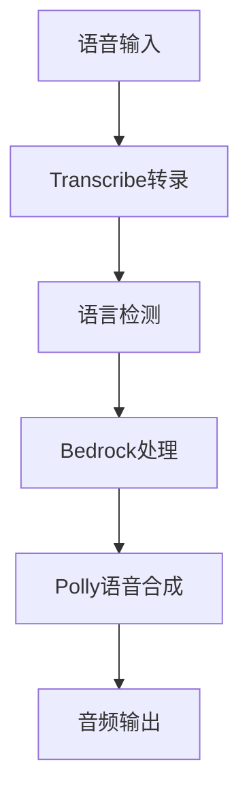

```markdown
# Amazon Bedrock 多语言语音对话

## 系统概述
基于 Amazon Bedrock 的多语言语音对话系统，支持中英文实时语音交互。

## 环境变量配置
python版本: python 3.13.0

第三方库下载:

1.直接使用 requirements.txt 直接下载
```
pip install ./requirements.txt
```
## 主要组件

### 1. 语言处理模块
```python
class BedrockModelsWrapper:
    @staticmethod
    def define_body(text, language):
        # 动态生成 Bedrock 请求体
        body['prompt'] = f"{text}, please output in {language}."
        return body
```

### 2. 语音交互流程


## 关键配置

| 配置项 | 默认值 | 说明 |
|--------|--------|------|
| MODEL_ID | meta.llama3-70b-instruct-v1 | 使用的Bedrock模型 |
| AWS_REGION | us-east-1 | AWS服务区域 |
| 日志级别 | debug | 调试信息输出 |

## 使用方法

### 启动流程
1. 设置环境变量
```bash
export MODEL_ID=your_model_id
export AWS_REGION=your_region
```

2. 运行主程序
```python
if __name__ == "__main__":
    loop = asyncio.new_event_loop()
    loop.run_until_complete(MicStream(selected_language).basic_transcribe())
```

### 语言切换
```python
def select_language():
    while True:
        language = input("选择语言 (zh/en): ")
        if language in ['zh', 'en']:
            return language
```

## 接口说明

### BedrockWrapper 类
```python
class BedrockWrapper:
    def invoke_bedrock(self, text, language):
        """调用Bedrock生成响应
        Args:
            text: 输入文本
            language: 目标语言(zh/en)
        """
```

## 注意事项

1. 依赖服务
- Amazon Transcribe
- Amazon Polly
- Amazon Bedrock

2. 硬件要求
- 麦克风输入设备
- 音频输出设备

3. 错误处理
```python
except Exception as e:
    print(f"Error: {e}")
    self.speaking = False
```

## 扩展建议

1. 支持更多语言
```python
language_mapping = {
    'en': {...},
    'zh': {...},
    # 可添加其他语言
}
```

2. 性能优化
- 增加语音端点检测(VAD)
- 实现流式响应

> 提示：实际部署时需要配置AWS凭证和权限
```

这个Markdown文档特点：
1. 采用代码块展示核心逻辑
2. 使用Mermaid流程图说明交互过程
3. 包含配置表格和接口说明
4. 提供扩展建议
5. 重点标注注意事项

可根据实际代码调整内容细节，需要补充其他模块说明请告知。